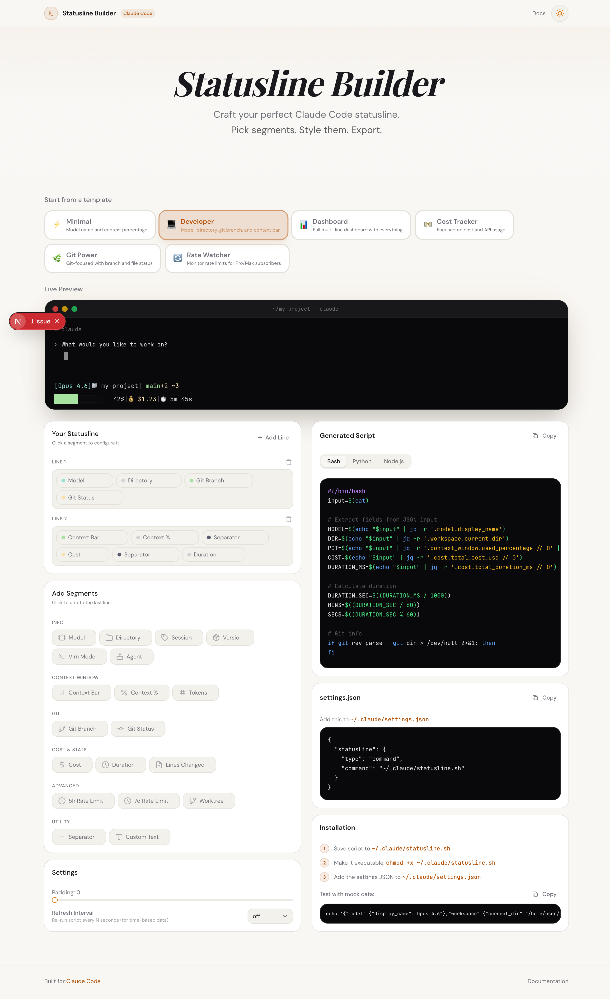

# Claude Code Statusline Builder

A visual editor for designing custom statuslines for [Claude Code](https://claude.ai/code). Pick segments, customize colors, see a live terminal preview, and export a ready-to-use script.



## Features

- **6 preset templates** - Minimal, Developer, Dashboard, Cost Tracker, Git Power, Rate Watcher
- **19 segment types** - Model, directory, git branch/status, context bar, cost, duration, tokens, rate limits, vim mode, and more
- **Live terminal preview** - See your statusline rendered in a realistic terminal mockup as you edit
- **Per-segment configuration** - ANSI color picker, bold toggle, prefix/suffix, bar width/style, threshold colors
- **Multi-line support** - Build single or multi-line statuslines
- **3-language export** - Generate scripts in Bash, Python, or Node.js
- **Copy-paste ready** - Generated script, settings.json, and test command all with one-click copy
- **Light & dark mode** - Toggle between themes; terminal and code blocks always stay dark

## Getting Started

```bash
npm install
npm run dev
```

Open [http://localhost:3000](http://localhost:3000).

## How It Works

1. **Pick a template** or start from scratch
2. **Add segments** from the palette (model name, git branch, context bar, cost, etc.)
3. **Configure each segment** - click it to change color, prefix/suffix, and type-specific options
4. **Copy the generated script** and save it to `~/.claude/statusline.sh`
5. **Add the settings JSON** to `~/.claude/settings.json`

## Tech Stack

- Next.js (App Router)
- React + TypeScript
- Tailwind CSS
- shadcn/ui

## Documentation

- [Claude Code Statusline Docs](https://code.claude.com/docs/en/statusline)
- [Claude Code](https://claude.ai/code)
